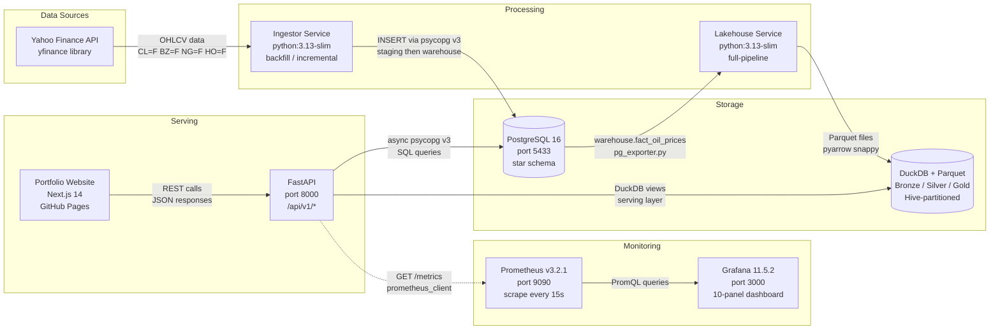
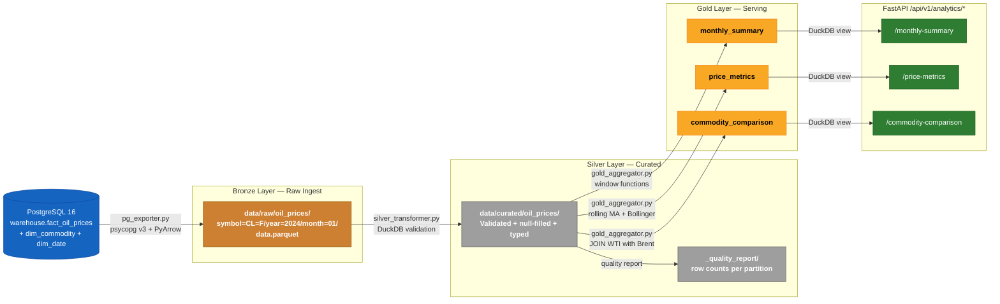
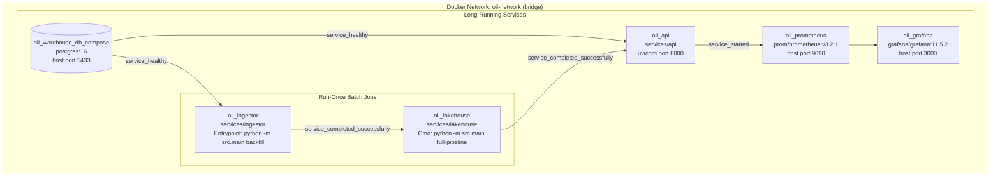
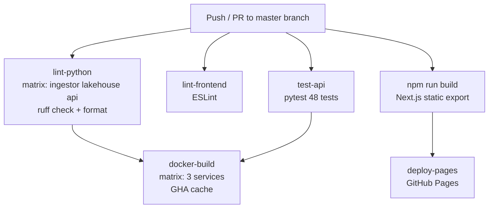
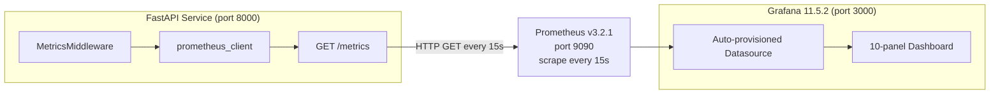
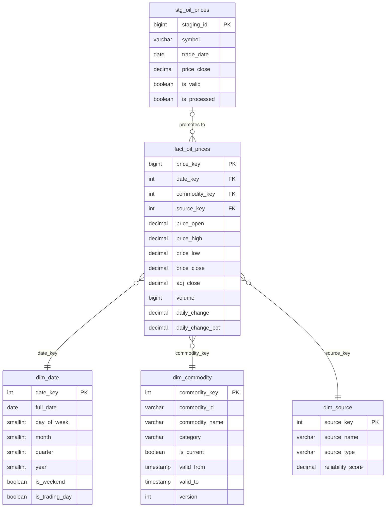

# Oil Price Data Pipeline — Full-Stack Data Engineering Portfolio

An end-to-end data engineering project built across 12 stages, demonstrating production-grade practices from raw data ingestion through a dimensional warehouse, analytical lakehouse, REST API, containerisation, CI/CD automation, and live monitoring — all tied together with a Next.js portfolio site.


---

## Architecture Overview



📎 [View as image](docs/diagrams/pipeline-overview.png)

The pipeline fetches daily OHLCV (open/high/low/close/volume) price data for four energy commodities — WTI Crude (`CL=F`), Brent Crude (`BZ=F`), Natural Gas (`NG=F`), and Heating Oil (`HO=F`) — from Yahoo Finance. The ingestor lands raw data in a PostgreSQL staging table, validates it, then promotes clean records to a dimensional warehouse. A separate lakehouse service reads the warehouse and writes Parquet files in a medallion (Bronze/Silver/Gold) architecture, which the FastAPI service queries via DuckDB for analytical endpoints.

The entire stack runs on Docker Compose for local development and is also deployable to Kubernetes via raw manifests or a Helm chart. A GitHub Actions CI pipeline covers linting, testing, and Docker builds. Prometheus scrapes the API's `/metrics` endpoint every 15 seconds, and Grafana visualises the results in a pre-built, auto-provisioned 10-panel dashboard.

---

## Tech Stack

| Category | Technologies |
|---|---|
| **Languages** | Python 3.13 (Docker), Python 3.14 (local dev), TypeScript, SQL |
| **API Framework** | FastAPI 0.115, Uvicorn, Starlette |
| **Databases** | PostgreSQL 16 (warehouse), DuckDB 1.2 (lakehouse query engine) |
| **Data Formats** | Apache Parquet (snappy), Hive-style partitioning |
| **Python DB** | psycopg v3, psycopg_pool (async + sync pools) |
| **Data Ingestion** | yfinance, tenacity (retry), PyArrow 18 |
| **Validation** | Pydantic v2, pydantic-settings |
| **Logging** | structlog (JSON structured logs) |
| **Monitoring** | Prometheus (prometheus-client), Grafana 11.5.2 |
| **Frontend** | Next.js 14, React 18, Tailwind CSS, Framer Motion |
| **Containers** | Docker (python:3.13-slim), Docker Compose |
| **Orchestration** | Kubernetes (raw manifests + Helm 3 chart) |
| **CI/CD** | GitHub Actions (ruff, ESLint, pytest, docker/build-push-action@v6) |
| **Linting** | ruff (Python), ESLint (TypeScript/Next.js) |
| **Testing** | pytest, httpx, unittest.mock |

---

## Pipeline Stages

### Stage 1 — Database Design & Setup

Designed a three-schema PostgreSQL data warehouse (`staging`, `warehouse`, `analytics`) with 11 SQL initialisation scripts. The warehouse uses a star schema: one central fact table (`fact_oil_prices`) surrounded by three dimension tables (`dim_date`, `dim_commodity`, `dim_source`). The date dimension is pre-populated for 2020–2035 using YYYYMMDD integer surrogate keys for fast range filtering. Eight stored procedures handle staging promotion, SCD Type 2 updates, and validation.

**Key highlights:** Star schema design, SCD Type 2 slowly-changing dimensions, `btree_gist` extension for exclusion constraints, `pg_stat_statements` for query performance monitoring.

### Stage 2 — Data Ingestion Service

Built the ingestor microservice (`services/ingestor/`) to extract daily OHLCV prices from Yahoo Finance via the `yfinance` library. The service implements a clean extract → validate → load pipeline with four CLI modes: `backfill` (full 5-year history), `incremental` (new data only), `refresh` (truncate + backfill), and `health` (connectivity check). Data lands in `staging.stg_oil_prices` before validation and promotion.

**Key highlights:** Abstract extractor base class, `tenacity` exponential-backoff retry, configurable batch size (500 rows/INSERT), structured JSON logging with `structlog`.

### Stage 3 — Data Validation & Quality

Implemented a `PriceValidator` that runs rule-based checks on every row before warehouse promotion: non-negative prices, close ≥ low ≥ 0, valid trade dates (no weekends/future dates), and required-field presence. Failed rows are quarantined in the staging table with a pipe-separated `validation_errors` column. Valid rows are promoted to `warehouse.fact_oil_prices` via the `sp_process_staging()` stored procedure.

**Key highlights:** Quarantine pattern (no silent discards), per-row error attribution, stored-procedure-managed atomic promotion, `is_valid`/`is_processed` lifecycle flags.

### Stage 4 — Data Warehouse Analytics Layer

Extended the PostgreSQL schema with an `analytics` schema containing pre-aggregated summary tables (`monthly_summary`, `price_metrics`) and six convenience views (`v_latest_prices`, `v_price_history`, etc.). Added 15+ strategic indexes covering foreign keys, partial indexes on `is_current = TRUE`, and composite indexes on frequent filter patterns. Wrote 21,000 lines of advanced SQL sample queries demonstrating window functions, CTEs, crosstabs, and rolling statistics.

**Key highlights:** Partial indexes for SCD Type 2, `tablefunc` extension for pivot queries, `DISTINCT ON` for efficient latest-row-per-commodity queries.

### Stage 5 — DuckDB + Parquet Lakehouse

Built a standalone lakehouse service (`services/lakehouse/`) implementing the medallion architecture over Parquet files. The **Bronze** layer exports raw data from PostgreSQL using PyArrow with Hive-style partitioning (`symbol=CL=F/year=2024/month=01/`). The **Silver** layer applies type coercion, null filling, and quality scoring via DuckDB. The **Gold** layer aggregates three serving datasets: `monthly_summary`, `price_metrics` (rolling MAs and Bollinger bands), and `commodity_comparison` (WTI vs Brent spread).

**Key highlights:** PyArrow typed schema enforcement at write time, DuckDB window functions for rolling statistics, quality score per partition, sub-second full pipeline execution.

### Stage 6 — FastAPI REST API

Developed a production-ready REST API (`services/api/`) with three routers serving two distinct backends. The prices router (`/api/v1/prices/*`) uses `async psycopg v3` with `AsyncConnectionPool` for live warehouse queries. The analytics router (`/api/v1/analytics/*`) uses synchronous DuckDB connections (per-request, thread-pool) over the Gold serving layer. Both backends are dependency-injected via FastAPI's `Depends()` mechanism.

**Key highlights:** Dual-backend architecture (PostgreSQL + DuckDB), async/sync mixed routing, `psycopg.rows.dict_row` for zero-overhead dict results, `_clean()` to replace `float('nan')` before JSON serialisation.

### Stage 7 — Docker Containerisation

Containerised all three Python services using `python:3.13-slim` base images with `libpq5` (runtime only — no build tools). The `docker-compose.yml` orchestrates six services with strict dependency ordering: the ingestor waits for PostgreSQL health (`pg_isready`), the lakehouse waits for ingestor completion (`service_completed_successfully`), and the API waits for both. Host port 5433 avoids conflicts with standalone development databases.

**Key highlights:** Minimal images (no `gcc`/`libpq-dev`), named volumes for Parquet persistence, multi-stage dependency chain, `ENTRYPOINT` + `CMD` split for runtime mode override.

### Stage 8 — Kubernetes & Helm

Created 29 files under `k8s/` covering both raw Kubernetes manifests and a parameterised Helm chart. The manifests deploy the full stack to a `oil-pipeline` namespace: PostgreSQL as a `Deployment` (with PVC), ingestor and lakehouse as `Job` resources (`restartPolicy: Never`), and the API as a 2-replica `Deployment` with `RollingUpdate` strategy. Init containers using `pg_isready` handle startup ordering.

**Key highlights:** `maxUnavailable: 0` rolling update for zero downtime, `ReadOnlyMany` PVC for lakehouse data shared between the Job and API pods, Helm `b64enc` for secret management, `helm test` connectivity pod.

### Stage 9 — CI/CD with GitHub Actions

Configured a six-job CI pipeline (`.github/workflows/ci.yml`) that runs on every push and pull request to `master`. The `lint-python` job uses a matrix strategy across all three services with `ruff`. The `test-api` job runs 48 pytest tests with fully mocked PostgreSQL (`MockAsyncCursor`/`MockAsyncConnection`) and real in-memory DuckDB. The `docker-build` job uses `docker/build-push-action@v6` with GitHub Actions layer caching (`type=gha`). The deploy workflow publishes the Next.js portfolio to GitHub Pages.

**Key highlights:** Matrix strategy for DRY lint/build across services, GHA layer cache for fast Docker builds, `TestClient` dependency overrides for zero-infrastructure testing.

### Stage 10 — Monitoring & Observability

Integrated Prometheus metrics into the FastAPI service via a custom `MetricsMiddleware` (Starlette `BaseHTTPMiddleware`) and added `prometheus`, `grafana` services to Docker Compose. The middleware instruments every request with counters, histograms, and in-progress gauges — skipping self-instrumentation of the `/metrics` endpoint. Grafana auto-provisions both the Prometheus datasource and the 10-panel "Oil Pipeline — API Monitoring" dashboard on first start with zero manual configuration.

**Key highlights:** `generate_latest()` scrape endpoint, `track_db_query` async context manager for DB timing, Hive-provisioned Grafana dashboard JSON (no manual import), 7-day TSDB retention.

### Stage 11 — Documentation & Architecture Diagrams

This stage. Produced comprehensive recruiter-facing documentation: this README, `docs/architecture.md`, per-service READMEs for all three Python services, six Mermaid architecture diagrams (all exported to PNG), and a `docs/README.md` index.

### Stage 12 — Portfolio Website

Built the portfolio site (`src/`) in Next.js 14 with TypeScript, Tailwind CSS, and Framer Motion animations. Static-exported and deployed to GitHub Pages via the `deploy.yml` workflow. Components include a hero section, skills pillars, projects showcase (featuring this pipeline), certifications, education, and a contact form.

---

## Data Flow Deep Dive



📎 [View as image](docs/diagrams/medallion-architecture.png)

Data moves through three progressive quality tiers. **Bronze** is an exact copy of the PostgreSQL warehouse, written as Parquet with Hive partitioning (`symbol=CL=F/year=2024/month=01/`) for efficient predicate pushdown. **Silver** applies validation (outlier detection, null filling, type coercion), records a per-partition quality score, and re-partitions. **Gold** aggregates three distinct analytical views: `monthly_summary` (avg/min/max/stddev per month), `price_metrics` (7/30/90-day moving averages, 20-day volatility, Bollinger bands), and `commodity_comparison` (daily WTI−Brent spread and ratio).

The medallion design was chosen because it enforces a clean separation between raw data preservation, quality curation, and serving optimisation. Each layer is independently queryable via DuckDB, making it easy to debug quality issues without re-running the full pipeline.

---

## Quick Start

### Prerequisites

- Docker Desktop (with Compose V2)
- Git

### Start the full stack

```bash
git clone https://github.com/Arash-devops/oil-pipeline-portfolio.git
cd oil-pipeline-portfolio
docker compose up --build
```

**What happens:**
1. PostgreSQL 16 starts and runs all 11 schema scripts from `database/init/`
2. Ingestor runs `backfill` — fetches ~5 years of OHLCV data for CL=F, BZ=F, NG=F, HO=F (~3–5 min)
3. Lakehouse runs `full-pipeline` — Bronze → Silver → Gold Parquet (~30 sec)
4. FastAPI starts on port 8000
5. Prometheus starts scraping at port 9090
6. Grafana starts at port 3000

### Access the services

| Service | URL | Credentials |
|---|---|---|
| API docs (Swagger UI) | http://localhost:8000/docs | — |
| Prometheus | http://localhost:9090 | — |
| Grafana | http://localhost:3000 | `admin` / `oilpipeline2026` |
| PostgreSQL | `localhost:5433` | `arash` / `warehouse_dev_2026` |

### Example API calls

```bash
# Latest price for all four commodities
curl http://localhost:8000/api/v1/prices/latest

# WTI crude price history for January 2024
curl "http://localhost:8000/api/v1/prices/history?commodity=CL%3DF&start_date=2024-01-01&end_date=2024-01-31"

# Monthly price summary (DuckDB/Gold layer)
curl "http://localhost:8000/api/v1/analytics/monthly-summary?commodity=CL%3DF&year=2024"

# WTI vs Brent spread
curl http://localhost:8000/api/v1/analytics/commodity-comparison?limit=30

# API health check
curl http://localhost:8000/api/v1/health
```

---

## API Reference

All endpoints return a standard envelope:

```json
{
  "status": "success",
  "data": [...],
  "meta": { "count": 4, "source": "postgresql", "query_time_ms": 2.31 }
}
```

| Method | Path | Backend | Description | Key Parameters |
|---|---|---|---|---|
| GET | `/api/v1/prices/latest` | PostgreSQL | Latest price per commodity | `commodity`, `limit` |
| GET | `/api/v1/prices/history` | PostgreSQL | Historical OHLCV with pagination | `commodity`, `start_date`, `end_date`, `limit`, `offset` |
| GET | `/api/v1/prices/commodities` | PostgreSQL | Active commodity dimension records | — |
| GET | `/api/v1/analytics/monthly-summary` | DuckDB | Monthly avg/min/max/stddev/volume | `commodity`, `year`, `limit` |
| GET | `/api/v1/analytics/price-metrics` | DuckDB | Rolling MAs, volatility, Bollinger bands | `commodity`, `start_date`, `end_date`, `limit` |
| GET | `/api/v1/analytics/commodity-comparison` | DuckDB | WTI vs Brent spread and ratio | `start_date`, `end_date`, `limit` |
| GET | `/api/v1/health` | Both | Liveness + readiness for both backends | — |
| GET | `/api/v1/info` | Both | API metadata and row counts | — |
| GET | `/metrics` | — | Prometheus scrape endpoint | — |

Valid commodity symbols: `CL=F` (WTI Crude), `BZ=F` (Brent Crude), `NG=F` (Natural Gas), `HO=F` (Heating Oil)

Full interactive documentation: http://localhost:8000/docs

---

## Infrastructure



📎 [View as image](docs/diagrams/docker-topology.png)

### Docker Compose

The `docker-compose.yml` orchestrates six services on a single bridge network (`oil-network`). PostgreSQL exposes host port 5433 (not 5432) to avoid conflicts with local development databases. The ingestor and lakehouse are **run-once** jobs that Docker starts, waits for completion, and never restarts. The API, Prometheus, and Grafana are long-running with `restart: unless-stopped`.

Named volumes persist data across `docker compose down` restarts: `pgdata` (PostgreSQL), `lakehouse-data` (Parquet files shared between lakehouse and API), `prometheus-data` (TSDB), `grafana-data` (dashboard state).

### Kubernetes

The `k8s/` directory provides two equivalent deployment paths:

- **Raw manifests** (`k8s/manifests/`): 11 YAML files applied in dependency order. Suitable for understanding each resource in isolation.
- **Helm chart** (`k8s/helm/oil-pipeline/`): Parameterised version of the same manifests. Install with `helm install oil-pipeline k8s/helm/oil-pipeline --namespace oil-pipeline --create-namespace`.

See [`k8s/README.md`](k8s/README.md) for full deployment instructions and production considerations.

### CI/CD



📎 [View as image](docs/diagrams/cicd-pipeline.png)

---

## Monitoring & Observability



📎 [View as image](docs/diagrams/monitoring-stack.png)

### Prometheus Metrics

| Metric | Type | Labels |
|---|---|---|
| `http_requests_total` | Counter | `method`, `endpoint`, `status_code` |
| `http_request_duration_seconds` | Histogram | `method`, `endpoint` |
| `http_requests_in_progress` | Gauge | `method` |
| `db_query_duration_seconds` | Histogram | `database`, `operation` |
| `app_info` | Gauge | `version` |

Standard `process_*` metrics (CPU, memory, file descriptors) are also exported automatically by `prometheus_client`.

### Grafana Dashboard — "Oil Pipeline — API Monitoring"

The dashboard (`monitoring/grafana/dashboards/oil-pipeline.json`) auto-loads on Grafana's first start with no manual import required.

| Row | Panels |
|---|---|
| Overview | Request Rate, Error Rate %, P95 Response Time, Requests In Progress |
| Request Details | Duration Heatmap, Requests by Endpoint |
| DB Performance | DB Query Duration P95, DB Query Rate |
| System | Process Memory, Process CPU |

> **Login:** http://localhost:3000 — `admin` / `oilpipeline2026`

---

## Data Warehouse Design



📎 [View as image](docs/diagrams/data-warehouse-schema.png)

The warehouse uses a **star schema** in a dedicated `warehouse` schema. The grain of `fact_oil_prices` is one row per trading day per commodity per data source, storing OHLCV prices as `DECIMAL(12,4)` plus pre-calculated `daily_change` and `daily_change_pct` columns. The date dimension uses YYYYMMDD integer surrogate keys for fast range scans.

`dim_commodity` implements **SCD Type 2**: each attribute change creates a new row with an incremented `version`. The `is_current = TRUE` partial index ensures point-in-time queries remain O(log n). The `btree_gist` extension supports exclusion constraints on date ranges to enforce non-overlapping version intervals.

Raw data arrives in the `staging.stg_oil_prices` landing table — no foreign key constraints, intentionally. The `sp_process_staging()` stored procedure validates rows in-place, stamps `is_valid`/`validation_errors`, then bulk-inserts passing rows into the warehouse using an `ON CONFLICT DO NOTHING` upsert.

---

## Project Structure

```
arash-portfolio/
├── .github/workflows/
│   ├── ci.yml                  # Lint + test + Docker build CI
│   └── deploy.yml              # Next.js → GitHub Pages CD
├── database/
│   ├── init/                   # 11 SQL scripts (00–10) run by Postgres on first start
│   └── README.md
├── docs/
│   ├── diagrams/               # 6 Mermaid .mmd files + 6 PNG exports
│   ├── architecture.md         # Deep-dive architecture document
│   └── README.md               # Documentation index
├── k8s/
│   ├── manifests/              # 11 raw Kubernetes YAML files
│   ├── helm/oil-pipeline/      # Helm chart (equivalent to manifests)
│   └── README.md
├── monitoring/
│   ├── grafana/
│   │   ├── dashboards/         # oil-pipeline.json (auto-provisioned)
│   │   └── provisioning/       # datasource + dashboard provider YAML
│   ├── prometheus/
│   │   └── prometheus.yml      # Scrape config targeting api:8000
│   └── README.md
├── services/
│   ├── api/                    # FastAPI service
│   │   ├── app/
│   │   │   ├── config.py       # pydantic-settings (OIL_API_ prefix)
│   │   │   ├── dependencies.py # PG pool + DuckDB dependency injection
│   │   │   ├── main.py         # App factory, lifespan, middleware
│   │   │   ├── metrics.py      # Prometheus metrics + middleware
│   │   │   ├── models/         # Pydantic request/response models
│   │   │   └── routers/        # health.py  prices.py  analytics.py
│   │   ├── tests/              # 48 pytest tests (mocked PG + real DuckDB)
│   │   ├── Dockerfile
│   │   └── requirements.txt
│   ├── ingestor/               # Yahoo Finance → PostgreSQL batch job
│   │   ├── src/
│   │   │   ├── extractor/      # yahoo_finance.py (abstract base + impl)
│   │   │   ├── loader/         # postgres_loader.py
│   │   │   ├── pipeline/       # ingestion_pipeline.py
│   │   │   ├── utils/          # db_connection.py  retry.py  logging
│   │   │   ├── validator/      # price_validator.py
│   │   │   ├── config.py
│   │   │   └── main.py         # CLI: backfill|incremental|refresh|health
│   │   ├── Dockerfile
│   │   └── requirements.txt
│   └── lakehouse/              # PostgreSQL → Parquet medallion pipeline
│       ├── src/
│       │   ├── aggregator/     # gold_aggregator.py  (Silver → Gold)
│       │   ├── exporter/       # pg_exporter.py      (PG → Bronze)
│       │   ├── query/          # duckdb_engine.py    (interactive SQL)
│       │   ├── transformer/    # silver_transformer.py (Bronze → Silver)
│       │   ├── utils/          # db_connection.py  logging_config.py
│       │   ├── config.py
│       │   └── main.py         # CLI: export|transform|aggregate|full-pipeline
│       ├── Dockerfile
│       └── requirements.txt
├── src/                        # Next.js 14 portfolio website
│   ├── app/                    # App Router (layout.tsx, page.tsx)
│   ├── components/             # Hero About Projects Skills Contact etc.
│   └── data/                   # projects.ts  skills.ts  education.ts
├── docker-compose.yml          # Full 6-service orchestration
├── next.config.js              # Static export + GitHub Pages basePath
├── ruff.toml                   # Python linter config (py313, line-length 120)
└── tailwind.config.ts
```

---

## Architecture Decisions

| Decision | Rationale |
|---|---|
| **psycopg v3 over psycopg2** | Python 3.14 dropped support for psycopg2's C extension build chain. psycopg v3 ships a pure-Python `[binary]` extra that works on any Python version. |
| **Star schema** | Optimised for the analytical query patterns of the API: latest-per-commodity (`DISTINCT ON`), date-range scans, and multi-commodity joins — all benefit from pre-joined dimension attributes. |
| **Medallion architecture** | Separates raw preservation (Bronze) from quality curation (Silver) from serving optimisation (Gold). Each layer is independently queryable for debugging. Adding a new Gold dataset doesn't require re-ingestion. |
| **DuckDB alongside PostgreSQL** | PostgreSQL excels at row-level transactional inserts and point queries; DuckDB excels at columnar scans over Parquet. The dual-backend design lets each tool do what it does best. |
| **FastAPI async + sync mix** | PostgreSQL endpoints use `async def` + `AsyncConnectionPool` for maximum throughput. DuckDB endpoints use `def` (FastAPI runs them in a thread pool) because DuckDB connections are not thread-safe for concurrent access. |
| **Prometheus pull-based scraping** | Pull is simpler to operate than push: no agent to manage, scrape interval is centrally configurable, and Prometheus handles backpressure automatically. |
| **Docker Compose for local, K8s for production** | Compose is fast to iterate with locally. The Helm chart provides a production-grade deployment with HPA, PDBs, and external secrets management as optional add-ons. |
| **Hive partitioning** | `symbol=CL=F/year=2024/month=01/` enables DuckDB and Spark to skip irrelevant partitions during scans, making commodity+date-range queries significantly faster as data grows. |
| **SCD Type 2 for dim_commodity** | Commodity metadata (name, exchange, unit) can change. SCD Type 2 preserves the history of what a commodity *was called* at the time of each price observation, enabling accurate historical reporting. |

---

## What I Learned

- **psycopg2 → psycopg v3 migration.** Python 3.14 removed the `distutils` module that psycopg2's C extension relies on at build time. Migrating to `psycopg[binary]>=3.1` required rewriting the connection-pool layer (`ThreadedConnectionPool` → `psycopg_pool.ConnectionPool`) and changing parameter placeholders from `%s` to `%s` (same) but adapting `executemany` call signatures and result-set handling.

- **Decimal serialisation through PyArrow.** PostgreSQL returns `NUMERIC`/`DECIMAL` columns as Python `decimal.Decimal` objects. PyArrow's `pa.float64()` schema field rejects these silently on some versions and raises a `TypeError` on others. The fix is to cast at query time: `CAST(price_close AS DOUBLE PRECISION)` in the export SQL, or a pre-write pandas `astype(float)` step.

- **DuckDB API stability.** Between DuckDB 0.8 and 1.0, `.fetch_arrow_table()` was renamed to `.arrow()` and `.df()` became `.fetchdf()`. Pinning to `duckdb>=1.0` in requirements and using `.fetchall()` + `conn.description` avoids the pandas dependency entirely and is stable across versions.

- **Docker dependency ordering is not enough.** `depends_on: condition: service_healthy` ensures PostgreSQL is *accepting connections*, but the schema initialisation scripts (11 SQL files) run asynchronously after the first connection succeeds. The ingestor's init-container `pg_isready` loop had to be replaced with a schema-readiness probe (`SELECT 1 FROM warehouse.fact_oil_prices LIMIT 0`) to avoid race conditions on first start.

- **Prometheus middleware placement matters.** Starlette middleware is applied in LIFO order. Adding `MetricsMiddleware` *after* `CORSMiddleware` in `create_app()` makes it the *outermost* wrapper, so it captures the total request time including CORS preflight processing — which is the correct behaviour for end-to-end latency measurement.

---

## Future Enhancements

- **Real-time streaming** — Replace the daily batch ingestor with Apache Kafka + Kafka Connect for tick-level price data.
- **dbt transformation layer** — Replace the custom `silver_transformer.py` and `gold_aggregator.py` with dbt models for version-controlled, testable SQL transformations.
- **Apache Airflow orchestration** — Move the `backfill → full-pipeline` sequence from Docker `depends_on` to a DAG with retries, SLAs, and alerting.
- **ML price forecasting** — Add a forecasting service using Prophet or a simple LSTM model trained on the Gold-layer `price_metrics` dataset.
- **Multi-cloud deployment** — Parameterise the Helm chart for AWS EKS (RDS Aurora for PostgreSQL, S3 for Parquet) vs GCP GKE (Cloud SQL, GCS) via environment-specific `values.yaml` overlays.

---

## License & Contact

This project is licensed under the **MIT License** — see [`LICENSE`](LICENSE) for details.

Built by **Arash** as a full-stack data engineering portfolio project.

- Portfolio: [arash-devops.github.io/oil-pipeline-portfolio](https://arash-devops.github.io/oil-pipeline-portfolio/)
- GitHub: [github.com/Arash-devops](https://github.com/Arash-devops)
