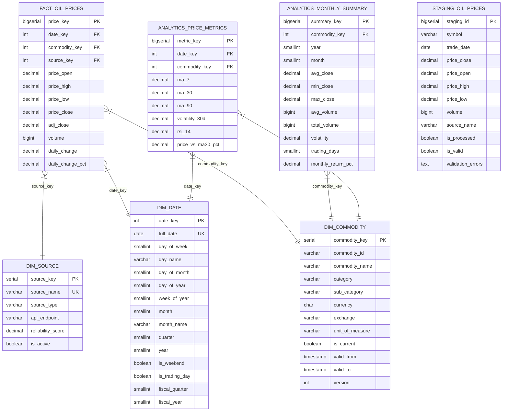

# Oil Price Data Warehouse — Star Schema

## Entity Relationship Diagram (Mermaid)



---

## ASCII Star Schema Overview

```
                         ┌─────────────────────┐
                         │    DIM_DATE          │
                         │  (date_key PK)       │
                         │  full_date           │
                         │  year, month, day    │
                         │  is_trading_day      │
                         └──────────┬──────────┘
                                    │ FK: date_key
                                    │
┌──────────────────┐     ┌──────────▼──────────┐     ┌──────────────────────┐
│  DIM_COMMODITY   │     │  FACT_OIL_PRICES     │     │    DIM_SOURCE        │
│  (commodity_key) ├────▶│  price_key  (PK)     │◀────┤  (source_key PK)     │
│  commodity_id    │     │  date_key   (FK)     │     │  source_name         │
│  commodity_name  │     │  commodity_key (FK)  │     │  source_type         │
│  category        │     │  source_key (FK)     │     │  reliability_score   │
│  SCD Type 2      │     │  price_open          │     └──────────────────────┘
│  is_current      │     │  price_high          │
└──────────────────┘     │  price_low           │
                         │  price_close  ◀──────┼─── PRIMARY MEASURE
                         │  volume              │
                         │  daily_change        │
                         │  daily_change_pct    │
                         └──────────┬───────────┘
                                    │
                    ┌───────────────┴───────────────┐
                    │                               │
         ┌──────────▼───────────┐   ┌───────────────▼──────────┐
         │ ANALYTICS_MONTHLY    │   │  ANALYTICS_PRICE_METRICS  │
         │ _SUMMARY             │   │                           │
         │ (commodity,year,mon) │   │  (date_key, commodity)    │
         │ avg_close            │   │  ma_7, ma_30, ma_90       │
         │ volatility           │   │  volatility_30d           │
         │ monthly_return_pct   │   │  rsi_14                   │
         └──────────────────────┘   └───────────────────────────┘

STAGING (separate schema — no FKs by design):
         ┌──────────────────────────────────────┐
         │  STAGING.STG_OIL_PRICES              │
         │  symbol (raw), trade_date (raw)      │
         │  is_valid, validation_errors         │
         │  is_processed, processed_at          │
         │         │                            │
         │         └──▶ sp_process_staging() ──▶│──▶ FACT_OIL_PRICES
         └──────────────────────────────────────┘
```

---

## Data Flow

```
External Source (Yahoo Finance API / Manual)
        │
        ▼
staging.stg_oil_prices          ← raw, no FK constraints
        │
        ├──▶ staging.sp_validate_staging_data()
        │           └── marks is_valid / validation_errors
        │
        └──▶ warehouse.sp_process_staging()
                    ├── calls sp_upsert_oil_price() per row
                    └── resolves/creates dim keys on the fly
                                │
                                ▼
                warehouse.fact_oil_prices   ← clean, conformed
                                │
                                ├──▶ analytics.sp_calculate_metrics()
                                │           └── analytics.price_metrics (MA, RSI, σ)
                                │
                                └──▶ analytics.sp_aggregate_monthly()
                                            └── analytics.monthly_summary
```
