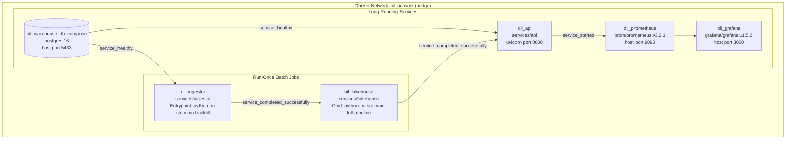
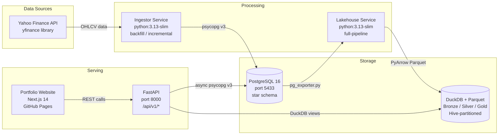
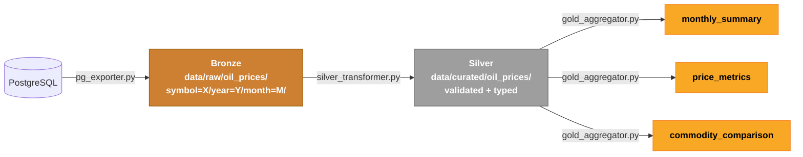
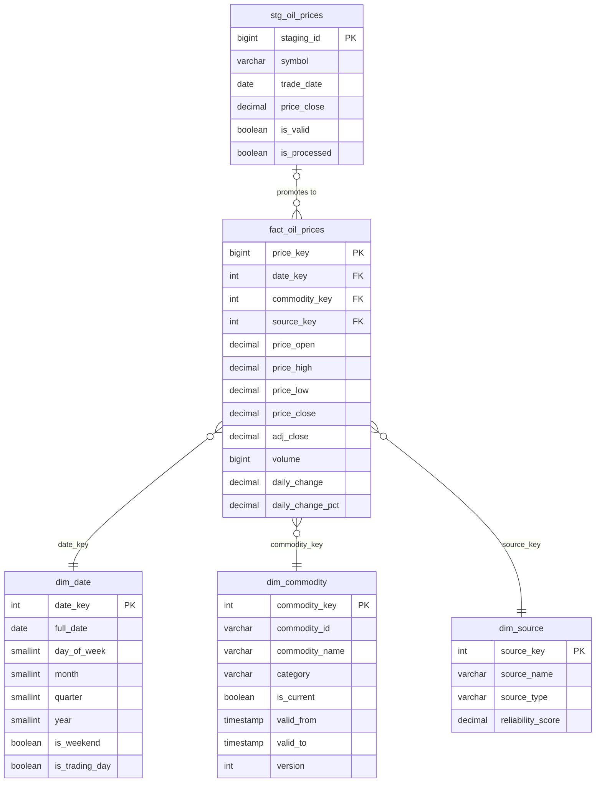
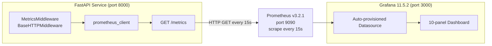
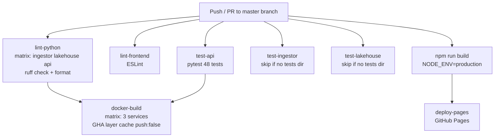

# Architecture — Oil Price Data Pipeline

This document provides a deep technical reference for every architectural layer of the project. For a higher-level overview, see the [root README](../README.md).

---

## 1. System Context

The system ingests daily energy commodity prices from Yahoo Finance and exposes them through two interfaces:

1. **REST API** — for programmatic consumption and portfolio showcase
2. **Grafana dashboard** — for operational monitoring of the API itself

External dependencies:

| Dependency | Direction | Protocol | Purpose |
|---|---|---|---|
| Yahoo Finance (via `yfinance`) | Inbound | HTTPS | Source of OHLCV price data |
| GitHub Pages | Outbound | HTTPS | Hosts the Next.js portfolio frontend |
| Prometheus (internal) | Pull | HTTP | Scrapes `/metrics` from the API |

The system is fully **offline-capable** once data is ingested: PostgreSQL and the Parquet lakehouse are local, and the API reads from them without any external network calls at query time.

---

## 2. Container Diagram



### Service Responsibilities

**`postgres` (oil_warehouse_db_compose)**
- Image: `postgres:16`
- Runs all 11 SQL initialisation scripts from `database/init/` on first start
- Exposes port 5433 on the host (5432 internally) to avoid conflicts with local development databases
- Health check: `pg_isready -U arash -d oil_warehouse` every 5 seconds

**`ingestor` (oil_ingestor)**
- Run-once batch job; Docker marks it `Completed` on exit 0
- Fetches 5 years of OHLCV history from Yahoo Finance for CL=F, BZ=F, NG=F, HO=F
- Inserts into `staging.stg_oil_prices`, runs validation, promotes to `warehouse.fact_oil_prices`
- Exit codes: 0 = all success, 1 = partial failure, 2 = total failure

**`lakehouse` (oil_lakehouse)**
- Run-once batch job; depends on ingestor completing successfully
- Reads `warehouse.fact_oil_prices` via psycopg v3, writes Bronze Parquet
- Transforms Bronze → Silver (DuckDB + PyArrow), aggregates Silver → Gold (DuckDB window functions)
- Writes to the `lakehouse-data` named volume at `/app/data`

**`api` (oil_api)**
- Long-running FastAPI/Uvicorn service
- Mounts `lakehouse-data` at `/opt/lakehouse/data` (read-only)
- `OIL_API_LAKEHOUSE_BASE_PATH=/opt/lakehouse` → serving path resolves to `/opt/lakehouse/data/serving/`
- Async PostgreSQL pool (min 2, max 10 connections) via psycopg_pool

**`prometheus` (oil_prometheus)**
- Scrapes `api:8000/metrics` every 15 seconds
- 7-day TSDB retention, persisted to `prometheus-data` volume
- `--web.enable-lifecycle` allows config reload without restart

**`grafana` (oil_grafana)**
- Reads provisioning config from `monitoring/grafana/provisioning/` (bind-mounted read-only)
- Reads dashboard JSON from `monitoring/grafana/dashboards/` (bind-mounted read-only)
- No manual setup required — datasource and dashboard auto-provision on first start

---

## 3. Data Flow

### 3.1 Ingestion



The ingestor pipeline follows a strict extract → validate → load sequence:

1. `YahooFinanceExtractor.fetch()` calls `yfinance.download()` with exponential-backoff retry (max 3 attempts, base delay 2 s)
2. `PriceValidator.validate()` checks: `price_close > 0`, `price_high >= price_low`, `trade_date` is not in the future, not a weekend, not a duplicate
3. `PostgresLoader.load()` batch-INSERTs into `staging.stg_oil_prices` (500 rows/batch)
4. `sp_process_staging()` stored procedure promotes valid rows to the warehouse atomically

### 3.2 Lakehouse Medallion Pipeline



**Bronze layer** (`data/raw/oil_prices/`): `pg_exporter.py` reads from `warehouse.fact_oil_prices` joined to dimension tables, then writes Parquet using PyArrow with a typed schema. Hive partitioning organises files as `symbol=CL=F/year=2024/month=01/data.parquet`. Compression: snappy.

**Silver layer** (`data/curated/oil_prices/`): `silver_transformer.py` opens Bronze partitions via DuckDB, applies null-filling (forward-fill for OHLCV, 0 for volume), validates price bounds, coerces data types, and re-writes with the same partition structure. A `_quality_report/` sub-directory records per-partition row counts and quality scores.

**Gold layer** (`data/serving/`): `gold_aggregator.py` reads Silver via DuckDB and produces three serving datasets:

| Dataset | Contents | Key SQL patterns |
|---|---|---|
| `monthly_summary` | avg/min/max/stddev close, total volume, monthly return % | `GROUP BY symbol, year, month` |
| `price_metrics` | 7/30/90-day MAs, 20-day volatility, Bollinger bands | `AVG() OVER (PARTITION BY symbol ORDER BY trade_date ROWS n PRECEDING)` |
| `commodity_comparison` | WTI close, Brent close, daily spread, price ratio | `JOIN CL=F with BZ=F ON trade_date` |

---

## 4. Data Model



### Schema design notes

**Three-schema isolation:** `staging` (no FK constraints, accepts dirty data), `warehouse` (star schema with referential integrity), `analytics` (pre-aggregated views and summary tables).

**Fact table grain:** One row per trading day × commodity × data source. The `UNIQUE (date_key, commodity_key, source_key)` constraint prevents duplicates and enables `ON CONFLICT DO NOTHING` upserts.

**SCD Type 2 on dim_commodity:** The `btree_gist` extension enables an exclusion constraint ensuring no two versions of the same `commodity_id` overlap. `valid_to = '9999-12-31 23:59:59'` marks the current version. The `is_current = TRUE` partial index makes `WHERE is_current = TRUE` queries O(log n) instead of sequential scans.

**Surrogate key strategy:** `dim_date` uses YYYYMMDD integers (e.g., `20240115`) — chosen over sequences because they are human-readable, sort naturally, and allow direct computation of date ranges without joining to the dimension. All other surrogate keys use `SERIAL`/`BIGSERIAL`.

---

## 5. API Layer

### Request pipeline

```
Client → MetricsMiddleware → CORSMiddleware → FastAPI Router → Dependency Injection → Handler
```

**Middleware order** (LIFO in Starlette — last-added is outermost):
1. `MetricsMiddleware` (outermost) — times full request, increments Prometheus counters
2. `CORSMiddleware` — handles preflight, adds CORS headers

**Dependency injection:**
- `get_pg_conn()` — yields an `AsyncConnection` from the `AsyncConnectionPool` (min 2, max 10)
- `get_duckdb_conn()` — creates a fresh in-memory DuckDB connection, registers 3 Parquet views, yields it, closes it

**Router structure:**

| Router | Prefix | Backend | Handler type |
|---|---|---|---|
| `health.py` | `/api/v1` | Both | `async def` |
| `prices.py` | `/api/v1/prices` | PostgreSQL | `async def` |
| `analytics.py` | `/api/v1/analytics` | DuckDB | `def` (thread pool) |

**Error handling:** Invalid commodity symbols return HTTP 422 with a descriptive detail message. Date-range inversions (`start > end`) also return 422. DuckDB query failures return 500 with a generic message (internal errors are logged with `structlog`).

**Null handling:** DuckDB may return `float('nan')` for NULL numeric columns. The `_clean()` helper in `analytics.py` normalises these to `None` before Pydantic serialisation, preventing `ValueError: Out of range float values are not JSON compliant`.

### Configuration

All settings use `pydantic-settings` with the `OIL_API_` prefix:

| Variable | Default | Description |
|---|---|---|
| `OIL_API_PG_HOST` | `localhost` | PostgreSQL host |
| `OIL_API_PG_PORT` | `5432` | PostgreSQL port |
| `OIL_API_PG_DATABASE` | `oil_warehouse` | Database name |
| `OIL_API_PG_USER` | `arash` | Database user |
| `OIL_API_PG_PASSWORD` | `warehouse_dev_2026` | Database password |
| `OIL_API_LAKEHOUSE_BASE_PATH` | auto-resolved | Root of lakehouse (serving path = `{base}/data/serving/`) |

---

## 6. Monitoring



### Metrics detail

**`http_requests_total` (Counter)**
Incremented once per completed request. Labels allow slicing by HTTP method, normalised endpoint path (trailing slash stripped), and HTTP status code. Use `rate()` in PromQL for per-second throughput.

**`http_request_duration_seconds` (Histogram)**
Measured from middleware entry to final response byte. Buckets from 5 ms to 10 s cover the expected range from fast DuckDB Gold-layer reads (< 10 ms) to slow cold-start PostgreSQL queries (up to several seconds). Use `histogram_quantile(0.95, ...)` for P95 latency.

**`http_requests_in_progress` (Gauge)**
Incremented at request start, decremented in the `finally` block. Provides instantaneous concurrency — useful for detecting request pile-ups during slow backend responses.

**`db_query_duration_seconds` (Histogram)**
Designed for explicit instrumentation using the `track_db_query` async context manager. Not currently wired into the dependency injection layer — the HTTP-level histogram captures total endpoint latency including database time. Buckets from 1 ms to 2.5 s.

**`app_info` (Gauge)**
Static — always 1. Used for `group_left(version)` joins in PromQL to annotate other metrics with the running application version.

---

## 7. CI/CD



### Job details

**`lint-python`** uses a matrix strategy (`ingestor`, `lakehouse`, `api`) to run `ruff check` and `ruff format --check` in parallel across all three services. Configuration is in `ruff.toml` at the project root: target Python 3.13, line length 120, rules E/W/F/I/UP/B/SIM. The `known-first-party = ["app", "src"]` setting ensures intra-project imports are sorted correctly.

**`test-api`** installs the full `services/api/requirements.txt` (including `httpx` and `pytest`) and runs 48 tests with `pytest tests/ -v --tb=short`. Tests use FastAPI's `TestClient` with `app.dependency_overrides` to replace `get_pg_conn` and `get_duckdb_conn`. PostgreSQL is fully mocked (`MockAsyncCursor`/`MockAsyncConnection`); DuckDB uses a real in-memory instance with test data pre-loaded as SQL `CREATE VIEW` statements — no Parquet files required.

**`docker-build`** runs only after `lint-python` and `test-api` pass. It uses `docker/build-push-action@v6` with `push: false` (validates the build without publishing to a registry). GitHub Actions layer caching (`type=gha`) means repeated builds only re-run changed layers.

---

## 8. Deployment

### Local (Docker Compose)

```bash
docker compose up --build          # First run: full backfill (~5–8 min total)
docker compose up                  # Subsequent runs: uses cached data
docker compose run ingestor python -m src.main incremental  # Refresh prices only
docker compose run lakehouse python -m src.main aggregate   # Rebuild Gold layer only
```

### Kubernetes (raw manifests)

```bash
kubectl apply -f k8s/manifests/namespace.yaml
kubectl apply -f k8s/manifests/configmap.yaml
kubectl apply -f k8s/manifests/secret.yaml
kubectl apply -f k8s/manifests/postgres-pvc.yaml
kubectl apply -f k8s/manifests/lakehouse-pvc.yaml
kubectl apply -f k8s/manifests/postgres-deployment.yaml
kubectl apply -f k8s/manifests/postgres-service.yaml
kubectl rollout status deployment/oil-pipeline-postgres -n oil-pipeline
kubectl apply -f k8s/manifests/ingestor-job.yaml
kubectl wait --for=condition=complete job/oil-pipeline-ingestor -n oil-pipeline --timeout=600s
kubectl apply -f k8s/manifests/lakehouse-job.yaml
kubectl wait --for=condition=complete job/oil-pipeline-lakehouse -n oil-pipeline --timeout=300s
kubectl apply -f k8s/manifests/api-deployment.yaml
kubectl apply -f k8s/manifests/api-service.yaml
kubectl port-forward svc/oil-pipeline-api -n oil-pipeline 8080:80
```

### Kubernetes (Helm)

```bash
helm install oil-pipeline k8s/helm/oil-pipeline \
  --namespace oil-pipeline \
  --create-namespace \
  --set postgres.credentials.password=<secure-password>

helm test oil-pipeline -n oil-pipeline   # Runs the connectivity test pod
```

### Production considerations

See [`k8s/README.md`](../k8s/README.md) for a full list. Key items:
- Replace the `Deployment` for PostgreSQL with a `StatefulSet` or managed RDS/Cloud SQL
- Replace base64 `Secret` with Sealed Secrets or External Secrets Operator
- Add `Ingress` + cert-manager for TLS termination
- Enable `api.autoscaling.enabled: true` in Helm values for HPA
- Add `NetworkPolicy` resources to restrict pod-to-pod traffic

---

## 9. Security Considerations

**Secrets management:** All credentials (PostgreSQL password, Grafana admin password) are passed via environment variables, never hardcoded in source files. In the Kubernetes manifests, they are stored as base64-encoded `Secret` resources with a clear warning to use Sealed Secrets in production. The `database/init/09-seed-data.sql` uses the same default development credentials as the compose file; a production deployment must override them.

**Network isolation:** All Docker services communicate on the `oil-network` bridge network. The PostgreSQL port (5432 internal) is only reachable by other containers on that network; the host-mapped port (5433) is for developer access only and should be removed in production.

**API authentication:** The current API has no authentication — appropriate for a portfolio demo. Production additions would include: JWT bearer tokens via FastAPI's `HTTPBearer` dependency, rate limiting via `slowapi`, and IP allowlisting for the `/metrics` endpoint.

**DuckDB SQL injection:** The analytics router builds `WHERE` clauses by appending positional `$1`, `$2` placeholders to a list — never string-formatting user input into SQL. The `_validate_commodity()` function checks all symbol inputs against a fixed allowlist (`VALID_COMMODITIES`) before they reach any query.

**Container hardening:** All Dockerfiles use `python:3.13-slim` (minimal attack surface), install only `libpq5` (runtime library, no compilers), and run as the default `root` user inside the container. Production hardening would add a non-root `USER` directive and a read-only filesystem where possible.
